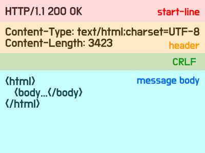

# HTTP 메시지

HTTP 메시지에 거의 모든 형태의 데이터가 전송 가능하다.

- *HTML, TEXT, 이미지, 음성, 영상, 파일, JSON, XML, ...*

## HTTP 메시지 구조



공식 스펙 ([https://tools.ietf.org/html/rfc7230#section-3](https://tools.ietf.org/html/rfc7230#section-3))

```text
HTTP-message  = start-line
                * ( header-field CRLF )
                CRLF
                [ message-body ]
```

### 시작 라인

<span style="font-size: 20px;">
  요청 메시지 (start-line = <b>request-line</b> / status-line) 
</span><br>
<span style="font-size: 18px; font-weight: lighter;">
  request-line = method SP(공백) request-target SP HTTP-version CRLF(엔터)
</span>

- method: HTTP 메서드
    - *GET, POST, PUT, DELETE, ...*
    - *서버가 수행해야 할 동작 지정*


- request-target: 요청 대상
    - *절대경로[?쿼리]: absolute-path[?query]*


- HTTP version
    - *HTTP/1.1, HTTP/2, HTTP/3, ...*

<span style="font-size: 20px;">
  응답 메시지 (start-line = request-line / <b>status-line</b>) 
</span><br>
<span style="font-size: 18px; font-weight: lighter;">
  status-line = HTTP-version SP status-code SP reason-phrase CRLF(엔터)
</span>

- HTTP version
    - *HTTP/1.1, HTTP/2, HTTP/3, ...*


- status-code: HTTP 상태 코드
    - *200: 성공*
    - *400: 클라이언트 요청 오류*
    - *500: 서버 내부 오류*


- reason-phrase: 이유 문구

### HTTP 헤더

<span style="font-size: 18px;">
  header-field = field-name":" OWS field-value OWS(OWS: 띄어쓰기 허용, field-name: 대소문자 구분 없음)
</span>

- HTTP 전송에 필요한 모든 부가정보
  - *메시지 바디의 내용, 메시지 바디의 크기, 압축, 인증, 요청 클라이언트 정보, 서버 애플리케이션 정보, 캐시 관리 정보, ...*
 
 
- 표준 헤더가 너무 많다. 
  - *[https://en.wikipedia.org/wiki/List_of_HTTP_header_fields](https://en.wikipedia.org/wiki/List_of_HTTP_header_fields)*
 
 
- 필요시 임의의 헤더 추가 가능


### HTTP 메시지 바디

- 실제 전송할 데이터
    - *HTML 문서, 이미지, 영상, JSON 등의 byte 로 표현할 수 있는 모든 데이터 전송 가능*


  


