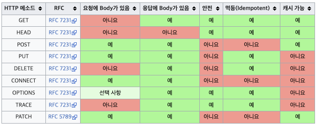

# HTTP 메서드

## HTTP API

회원 정보 관리 API 를 만들어 달라는 요청을 받았고, 요구사항이 아래와 같다.

- *회원 목록 조회*
- *회원 조회*
- *회원 등록*
- *회원 수정*
- *회원 삭제*

요구사항에 맞는 API URI 를 설계해보자.

- *회원 목록 조회: /read-member-list*
- *회원 조회: /read-member-by-id*
- *회원 등록: /create-member*
- *회원 수정: /update-member*
- *회원 삭제: /delete-member*

위와 같은 URI 설계는 좋은 설계일까..? URI 를 설계할 때의 가장 중요한 포인트는 **리소스 식별** 이다.

여기서 리소스의 의미는 무엇일까..? 위의 설계처럼 회원을 등록하고 수정하고 조회하는 것 자체는 리소스가 아니다

**"회원" 이라는 개념 자체가 바로 리소스다.**

그렇다면 회원을 등록하고 수정하고 조회한다는 행동을 배제하고 URI 계층 구조를 활용하여 회원이라는 리소스에만 접근해보자.

(계층 구조상 상위를 컬렉션으로 보고 복수단어 사용을 권장한다.)

- *회원 목록 조회: /members*
- *회원 조회: /members/{id}*
- *회원 등록: /members/{id}*
- *회원 수정: /members/{id}*
- *회원 삭제: /members/{id}*

URI 계층 구조를 활용하여 해당하는 회원 리소스를 식별하였다. 

회원 조회, 등록, 수정, 삭제 모두 같은 URI 형태를 띄고 있어서 행위에 대해 구분할 수 가 없다.

여기서 중요한 포인트는 URI 는 리소스만 식별하고, 리소스를 대상으로 하는 **행위**는 분리한다는 점이다.

그렇다면 행위에 대해서는 어떻게 구분을 할 수 있을까?

## HTTP 메서드

위에서 구분하지 못한 행위 대해서는 HTTP 메서드로서 구분할 수 있다.

### HTTP 메서드 종류

주요 메서드 

- *GET: 리소스 조회*
  

- *POST: 요청 데이터 처리, 주로 등록에 사용*
  

- *PUT: 리소스 대체, 해당 리소스가 없으면 생성*
  

- *PATCH: 리소스 부분 변경*
  

- *DELETE: 리소스 삭제*
  
기타 메서드

- *HEAD: GET 과 동일하지만 메시지 부분을 제외하고, 상태 줄과 헤더만 반환*
- *OPTIONS: 대상 리소스에 대한 통신 가능 옵션(메서드)을 설명, 주로 CORS 에서 사용*
- *CONNECT: 대상 리소스로 식별되는 서버에 대한 터널을 설정*
- *TRACE: 대상 리소스에 대한 경로를 따라 메시지 루프백 테스트를 수행*

주요 메서드에 대해서 자세하게 알아보자

#### GET

- 리소스 조회
- 서버에 전달하고 싶은 데이터는 query(쿼리 파라미터, 쿼리 스트링)를 통해서 전달
- 메시지 바디를 사용해서 데이터를 전달할 수 있지만, 지원하지 않는 곳이 많아서 권장하지 않는다.

#### POST

- 요청 데이터 처리
- **메시지 바디를 통해 서버로 요청 데이터 전달**
- 주로 전달된 데이터로 신규 리소스 등록, 프로세스 처리에 사용

스펙 상에 POST 메서드는 **대상 리소스가 리소스의 고유한 의미 체계에 따라 요청에 포함된 표현을 처리하도록 요청**한다 라고 되어있다.

예를 들어 POST 는,

- *HTML Form 에 입력한 정보로 회원 가입, 주문 등에서 사용*

- *게시판 글쓰기, 댓글 달기*

- *신규 주문 생성*

- *한 문서 끝에 내용 추가하기*

이와 같은 방법으로 사용된다.

즉, 정해진 것이 없다는 얘기다.

해당 리소스 URI 에 POST 요청이 오면 요청 데이터를 어떻게 처리할 지 리소스마다 따로 정한대로 처리 된다. 

#### PUT

- 리소스를 대체
    - *리소스가 있으면 대체*
    - *리소스가 없으면 생성*

PUT 의 가장 큰 특징은 **클라이언트가 리소스를 식별** 한다는 점이다.

클라이언트가 리소스 위치를 알고 URI 를 지정해서 요청을 보낸다. 이 점이 POST 와의 차이점이다.

#### PATCH

- 리소스 부분 변경

#### DELETE

- 리소스 제거

## HTTP 메서드의 속성
- 안전(Safe Methods)
- 멱등(Idempotent Methods)
- 캐시가능(Cacheable Methods)

  
[출처: https://ko.wikipedia.org/wiki/HTTP](https://ko.wikipedia.org/wiki/HTTP)

### 안전, Safe

- 호출해도 리소스를 변경하지 않는다.

### 멱등, Idempotent

- 한 번 호출하든 두 번 호출하든 100번을 호출하든 결과가 똑같다.
- 멱등 메서드
    - GET: 한 번 조회하든, 두 번 조회하든 같은 결과가 조회된다.
    - PUT: 결과를 대체한다. 따라서 같은 요청을 여러번 해도 최종 결과는 같다.
    - DELETE: 결과를 삭제한다. 같은 요청을 여러번 해도 삭제된 결과는 똑같다.

- POST 메서드는 멱등이 아니다. 
    - 예를 들어 결제의 경우 두 번 호출하면 같은 결제가 중복해서 발생할 수 있다.
    
- 활용
    - 자동 복구 메커니즘
    - 서버가 TIMEOUT 등으로 정상 응답을 못 주었을 때, 클라이언트가 같은 요청을 다시 해도 되는가? 에 대한 판단 근거
    
### 캐시가능, Cacheable

- 응답 결과 리소스를 캐시해서 사용해도 되는가?
- GET, HEAD, POST, PATCH 캐시가능
- 실제로는 GET, HEAD 정도만 캐시로 사용
- POST, PATCH 는 본문 내용까지 캐시 키로 고려해야 하는데 구현이 쉽지 않음

