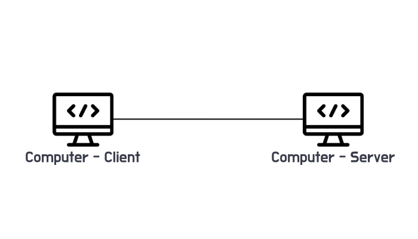

# 인터넷 네트워크

멀리 떨어져 있는 두 컴퓨터는 어떻게 통신할까?

## 인터넷 통신
정답은 인터넷을 이용한다!

하지만 인터넷 망은 수많은 노드로 이루어져 있어서 아쥬 복잡하다.

그렇다면 이 복잡한 인터넷 망에서 두 컴퓨터는 어떻게 서로를 찾아갈 수 있을까?

## IP(Internet Protocol)

서로의 컴퓨터를 찾아갈 수 있도록 각 컴퓨터에 고유한 주소를 부여하자.

그리고 그 주소를 **IP 주소**라고 부르자. 

지정한 IP 주소에 데이터를 전달하며 패킷(Packet) 이라는 통신 단위로 전달한다.

> **IP (Internet Protocol)**  
> 송신 호스트와 수신 호스트가 패킷 교환 네트워크에서 정보를 주고받는 데 사용하는 정보 위주의 규역이며,  
> OSI 네트워크 계층에서 호스트의 주소지정과 패킷 분할 및 조립 기능을 담당한다. 줄여서 아이피(IP)라고 한다.   
> [인터넷 프로토콜 - 위키백과, 우리 모두의 백과사전.
](https://ko.wikipedia.org/wiki/%EC%9D%B8%ED%84%B0%EB%84%B7_%ED%94%84%EB%A1%9C%ED%86%A0%EC%BD%9C)

IP 패킷에는 출발지 IP, 목적지 IP 등의 정보가 포함되어 있어서

클라이언트 역할의 컴퓨터에서 출발지 IP 와 목적지 IP 정보를 패킷에 담아서 전달하면

인터넷 망의 각각의 노드가 해당 정보를 참고하여 목적이 IP 에 해당하는 서버 역할의 컴퓨터까지 패킷을 전달한다.

또한 서버 역할의 컴퓨터에서도 패킷의 출발지 IP 정보를 참고하여 같은 방법으로 클라이언트에게 응답할 수 있다.

이러한 방식으로 멀리 떨어져 있는 두 컴퓨터는 인터넷 망과 IP 를 통해서 통신할 수 있는 것이다.

그런데 여기서 문제는 만약 서버가 없어진 서버라던지, 아니면 서비스가 불가능한 서버라 할 지라도 그 상황을 알 리 없는 클라이언트는 패킷을 전송한다. **(비연결성)**

그리고 복잡한 인터넷 망의 여러 노드를 거치는 중간에 노드에 문제가 발생하여 패킷이 사라질 수 있고,

무사히 서버에 패킷들을 전달하였지만, 클라이언트에서 보낸 패킷들과 순서가 다르게 도착한다면 문제가 발생할 수 있다. **(비신뢰성)**

또한, 하나의 IP 를 가진 서버에서 통신하는 애플리케이션이 둘 이상이어서 어떤 애플리케이션에게 데이터가 전달되어야 하는지 구분이 모호하다. **(프로그램 구분)**

이러한 IP 에서 발생할 수 있는 문제점은 어떻게 해결 할 수 있을까?

여기서 먼저 인터넷 프로토콜의 계층에 대해서 알아보면,...

## 인터넷 프로토콜 스택의 4계층

인터넷 프로토콜 스택은 4계층으로 구성되어 있다.

- *애플리케이션 계층* - HTTP, FTP, ...  

- *전송 계층* - TCP, UDP

- *인터넷 계층* - IP

- *네트워크 인터페이스 계층*

클라이언트가 프로그램을 통해 "Hello, world!" 라는 메시지를 생성하여 서버로 전달한다고 가정하자.

가장 먼저, "Hello, world!" 라는 데이터가 생성이 되고, SOCKET 라이브러리를 통해 전달한다.

여기까지 과정이 애플리케이션 계층에서 일어나는 일이며,

그 다음 TCP 정보를 생성하고 그 안에 애플리케이션 계층에서 생성된 데이터를 포함시킨다.

여기까지 과정이 전송 계층에서 일어나는 일이다.

그 다음 IP 패킷을 생성하고 그 안에 애플리케이션 계층에서 생성된 데이터를 포함시킨 TCP 정보를 담고 있는 데이터를 포함시킨다.

여기까지 과정이 인터넷 계층이다.

마지막으로 네트워크 상의 호스트나 노드를 상호 연결하기 위해 사용되는 물리, 논리 네트워크 구성 요소를 담고 있는 이더넷 프레임을 생성하고

그 안에 애플리케이션 계층에서 생성된 데이터를 포함시킨 TCP 의 정보를 담고 있는 IP 패킷을 포함시킨다.

이렇게 만들어진 이더넷 프레임이 인터넷망으로 전달되는 것이다.

그럼 앞서 IP 패킷에서는 출발지 IP 와 목적지 IP 등을 포함하고 있다면 TCP 는 어떤 정보를 담고 있는지 알아보자.

## TCP, UDP

### TCP
TCP 세그먼트에는 출발지 PORT, 목적지 PORT, 전송 제어, 순서, 검증 정보 등의 전송 정보가 담겨있다.

또한 TCP 는 전송 제어 프로토콜(Transmission Control Protocol) 의 줄인말로 다음과 같은 특징들을 가졌다.

- *연결지향 - TCP 3 way handshake → 가상 연결*

- *데이터 전달 보증*

- *순서 보장*

이러한 특징들을 가지고 있어 **신뢰할 수 있는 프로토콜** 이라고도 한다.

특징들을 자세히 알아보면, TCP 3 way handshake 는 데이터 전송이전에 연결을 하는 방식을 말한다.

1. *클라이언트로부터 서버로 `SYN:접속요청` 을 한다.*

2. *존재하고 있고, 서비스가 가능한 유효한 서버일 경우 `SYN:접속요청` 과 `ACK:요청수락` 을 함께 클라이언트로 전달한다.*

3. *클라이언트로부터 서버로 `ACK:요청수락` 과 함께 데이터 전송이 가능하다.*

앞에서 연결하는 방식이라고 하였지만, 실제로는 가상 연결이며 계속에서 이어져있는 상태를 말하는 것이 아니다.

하지만 이러한 연결 방식을 통해서 IP 가 가지고 있는 비연결성에 대한 문제점을 해결 할 수 있다.

다음 특징으로는 TCP 의 경우 클라이언트로부터 서버로 데이터가 전송되면 서버 측에서 데이터를 잘 받았다라는 응답을 클라이언트에게 하도록 되어있다.

또한, 전송한 패킷들에 대해서 순서가 보장되는데 예를 들어 클라이언트로부터 패킷1, 패킷2, 패킷3 의 순서로 패킷들을 전송하였는데,

서버측에 패킷1, 패킷3, 패킷2 순서로 도착하였다면 서버는 클라이언트에게 패킷2 부터 다시 보내라는 메시지를 보낸다.

이러한 특징들을 통해 IP 의 비신뢰성 문제를 해결할 수 있다.

### PORT

PORT 또한 TCP 에 포함되어 있는 정보인데,

PORT 는 하나의 IP를 가지는 서버 내에 여러 애플리케이션(프로세스)이 있는데 클라이언트가 그 중 원하는 애플리케이션을 구분할 수 있는 정보이다.

이 정보를 통해서 IP 패킷이 서버의 여러 애플리케이션이 있더라도 구분하여 도착할 수 있도록 해준다.

PORT 는 기본적으로 0 부터 65535 까지 할당이 가능한데, 0 부터 1023 까지는 잘 알려진 포트라 사용하지 않는 것이 좋다.

*대표적인 예*
- *FTP - 20, 21*
- *TELNET - 23*
- *HTTP - 80*
- *HTTPS - 443*

### UDP

TCP 와 마찬가지로 인터넷 프로토콜의 전송계층에 있는 UDP 는 사용자 데이터그램 프로토콜(User Datagram Protocol) 을 말한다.

기능이 거의 없어 하얀 도화지에 비유하기도 하며, TCP 의 특징인 연결지향, 데이터 전달 보증, 순서 보장을 가지고 있지 않다.

UDP 는 데이터 전달 및 순서가 보장되지 않지만, 단순하고 빠르다.

즉, IP 와 거의 같지만 PORT, 체크섬 정보만 추가되어 있고 애플리케이션에서 추가 작업이 필요하다.

앞에서 IP 의 비연결성, 비신뢰성, 프로그램 구분에 대한 문제들은 TCP, PORT 를 통해서 해결 할 수 있었다.

그러나 IP 의 가장 큰 문제는 IP 주소 자체에 있다. 딱 봐도 기억하기 어렵고 기억했다 한들 변경되면 또 변경된 IP 주소를 알아내고 기억하고 있고

변경이 되는지 확인해야되는 문제가 발생한다. 이러한 불편함은 어떻게 해결할 수 있을까?

## DNS

IP 주소의 문제에 대해서는 DNS 를 사용하면 해결할 수 있다.

DNS 는 도메인 네임 시스템(Domain Name System) 을 말하며, 도메인 명을 입력하면 IP 주소로 변환해주는 시스템을 말한다.

서버의 IP 주소(예: 200.200.200.2) 를 DNS 서버에 도메인 명을 aaa.com 으로하여 등록해 놓으면,

클라이언트에서 도메인명 aaa.com 으로 접근하면 DNS 서버에서 도메인명에 해당하는 서버의 IP를 반환해준다.

서버의 IP가 변경되더라도 DNS 서버에 IP 가 반영될 것이고, 클라이언트는 서버의 도메인명만 알고 있으면 된다.

